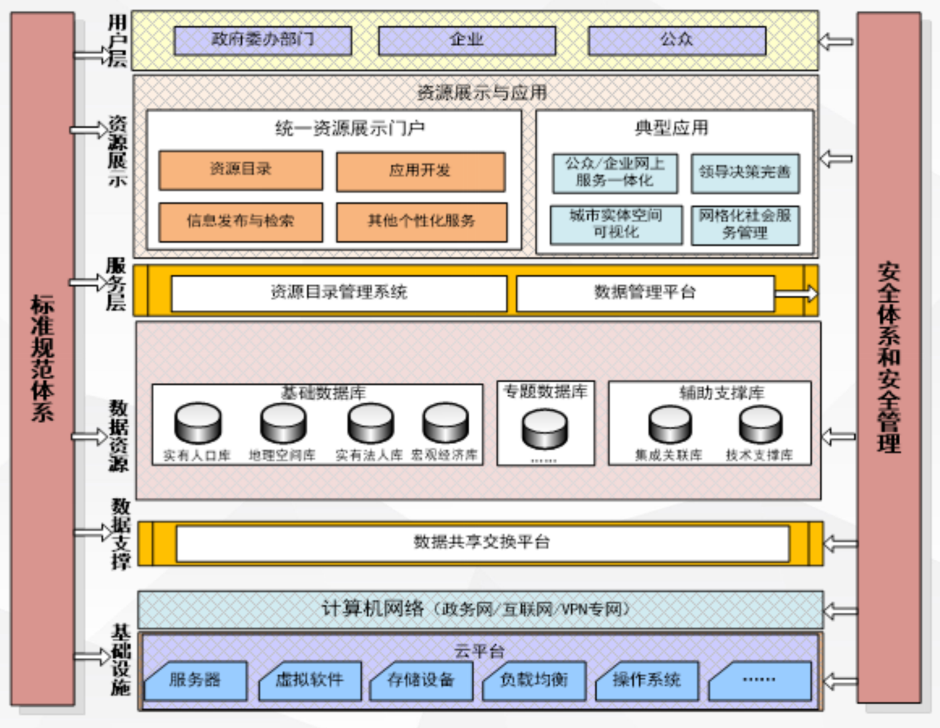
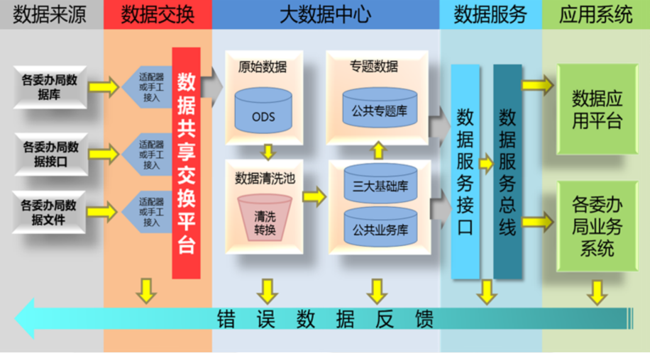
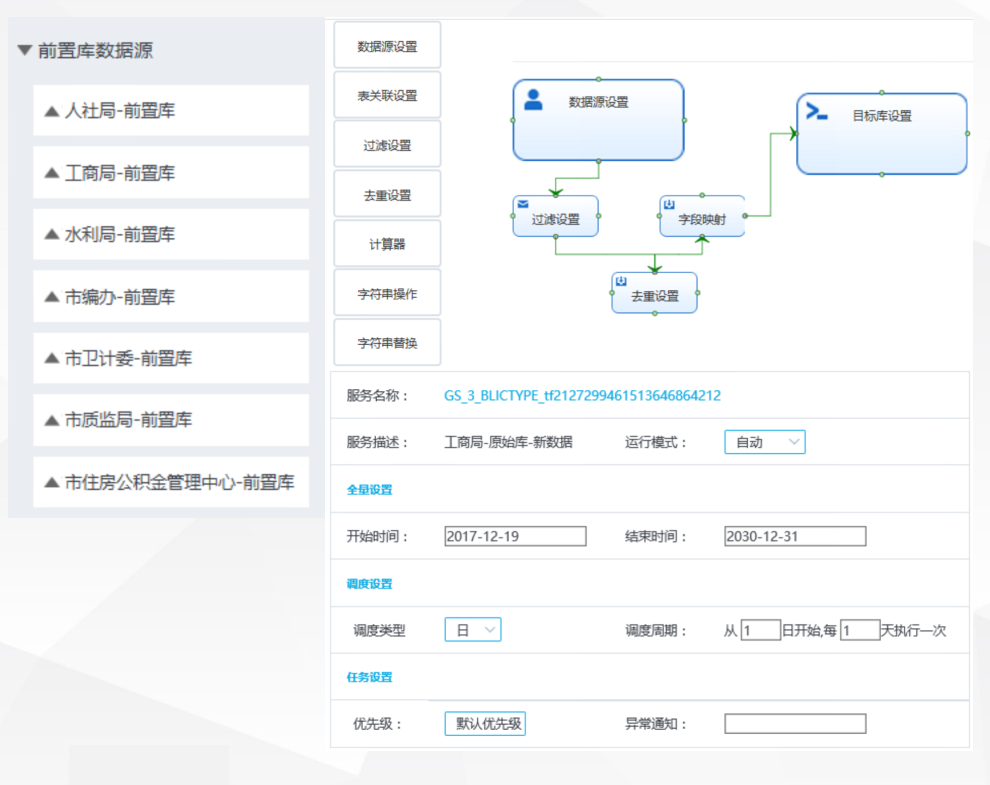
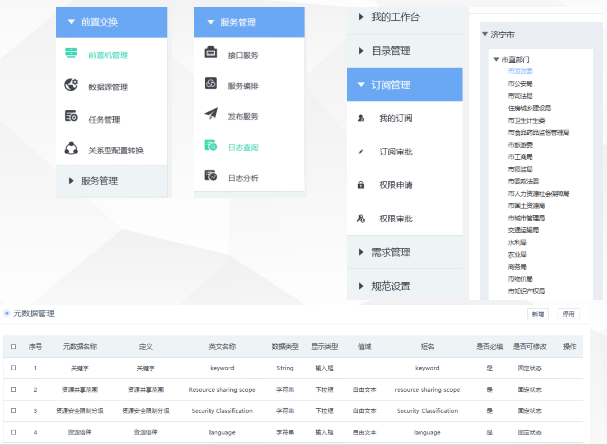

## Data sharing and exchange system 数据共享交换系统

### Overview 概述

The data sharing and exchange system provides stable, reliable, safe and efficient data sharing and exchange services for various departments. The data sharing and exchange platform provides a complete set of standardized, efficient and secure data exchange mechanisms. The data sharing and exchange platform is composed of front-end machines deployed on the sharing platform and various business departments to solve the problems of how to collect data and how to distribute data.
The data sharing and exchange system mainly realizes four functions: first, it realizes the docking with the data exchange system of the superior data center, undertakes the shared business data provided by the superior data center, and reports the shared business data to the superior data center; second, it provides data exchange services for the member units of the sharing system; third, it realizes the docking with the e-government application system and provides data sharing services; fourth, it realizes the docking with the subordinate sharing system and provides data sharing services.
The data sharing and exchange system is responsible for providing information resource exchange transmission and process monitoring, focusing on solving the unified management and monitoring problems of data exchange. The information database data management platform function is used to form a physically centralized basic information database such as legal person and macroeconomics on the basis of data exchange, and display the accessed data.

数据共享交换系统为各部门提供稳定可靠、安全高效的数据共享交换服务。数据共享交换平台提供一整套规范的、高效的、安全的数据交换机制。数据共享交换平台由部署在共享平台和各业务部门的前置机共同组成，解决如何采集数据、如何分发数据的问题。数据共享交换系统主要实现四方面功能：一是实现与上级数据中心的数据交换系统对接，承接上级数据中心提供的共享业务数据，向上级数据中心上报共享业务数据；二是面向共享系统成员单位提供数据交换服务；三是实现与电子政务应用系统的对接，提供数据共享服务；四是实现与下级共享系统的对接，提供数据共享服务。数据共享交换系统负责提供信息资源的交换传输和过程监控，重点解决数据交换的统一管理和监控问题。信息库数据管理平台功能用于在数据交换的基础上形成物理上集中的法人、宏观经济等基础信息库，对接入的数据进行展示。

### System Architecture 系统架构

Infrastructure layer: It provides computing services, network services, security services, storage services, information resource services, and operating environment, common support, general components and other supporting software services to all government departments in the district. It can support business applications of government departments, government field applications, leadership decision-making applications and other applications. The construction of the data sharing and exchange platform relies on the district's existing government cloud for unified construction and deployment.

基础设施层：实现了面向全区各政府部门提供计算服务、网络服务、安全服务、存储服务、信息资源服务、以及运行环境、共性支撑、通用组件等支撑软件服务。可支撑政务部门业务应用、政务领域应用、领导决策应用及其他应用，数据共享交换平台的建设依托区已有的政务云进行统一建设部署。

Data support layer: Based on the overall planning of government information resource construction, it realizes the exchange and integration of data from different sources, and sets up various database systems such as integrated basic databases and special databases according to different application modes, and realizes the integrated integration, management and monitoring of massive information resources, providing data service support at different levels to the outside world. This period mainly builds three basic databases: legal person, geography, and macroeconomics.

数据支撑层：围绕政务信息资源建设的总体规划，实现不同来源数据的交换，整合加工，并按照不同应用模式设置整合基础库、专题库等多种数据库体系，并且实现海量信息资源的一体化整合、管理与监控，对外提供不同层面的数据服务支撑。本期主要建设法人、地理、宏观经济3大基础数据库。

Service layer: With the data service bus as the core, it builds supporting support systems and service functions around the needs of data resource registration management, service security management, and service operation monitoring, and provides various forms of service interfaces to meet the needs of platform service management and monitoring. Through the service secondary development interface, the platform data, functions and service capabilities are provided to the outside world.

服务层：以数据服务总线为核心，为围绕数据资源的注册管理、服务安全管理以及服务运行监控等需求，建设配套的支撑系统和服务功能，提供多种形式的服务接口，实现平台服务管理与监控需要。通过服务二次开发接口，实现平台数据、功能和服务能力的对外提供。

Application layer (resource display layer and user layer): Build a unified resource display portal system to meet the different application needs of administrators, government users and public users, provide atomic services based on the platform's various support systems, and aggregate them into corresponding functional interface sets to support various applications built on the platform. At the same time, multiple typical applications can be built based on the platform.

应用层（资源展示层及用户层）：搭建统一资源展示门户系统针对管理员、政务用户和公众用户的不同应用需求，提供基于平台各支撑系统的原子服务，并聚合成相应的功能接口集，以支撑构建于平台基础上的各类应用。同时基于平台可搭建多类典型应用。

Security assurance and standard specification system: Provide unified identity authentication and authority management functions. Follow the national standards and industry standards related to information system construction to ensure the safe and stable operation of the platform and the unified planning and implementation. This project relies on the construction of an existing security assurance system.

安全保障及标准规范体系：提供统一的身份认证及权限管理功能。遵循信息系统建设相关的国家标准和行业标准，保障平台的安全稳定运行和统一规划实施。本项目依托已有安全保障体系建设。

1. All data from source systems are integrated into the ODS database of the data center through the data sharing and exchange platform;
2. The data in the data center is divided into two categories, namely, big database data and ODS database data. Among them, big database data: data after cleaning and conversion, including three basic databases (legal person database, macroeconomic database, geographic information database), public business database, and public subject database. The main differences between these two types of data are as follows;
Different data quality standards: data in the ODS database is directly integrated with the original information system, and the data integrity and consistency are poor; data stored in the big database is data after data integration and cleaning (to ensure integrity, consistency, and timeliness);
Different data service methods: data in the ODS database, the data center provides certified database query services; data in the big database, the data service API (Data API) is developed by the big data management platform, and then data services are provided through the data service bus.
The data center is implemented by traditional relational databases (Oracle, DB2, etc.) and non-relational databases (Hive, HBase, etc.) carried by Hadoop HDFS. Traditional relational data is mainly used for structured data storage, and non-relational databases are mainly used for unstructured data and flat data storage. The main difference between these two types of databases in terms of data processing tasks is that the database based on the Hadoop big data platform (referred to as: big database) does not undertake the data storage and processing of the ODS database compared to the traditional database.
In addition to the construction of the real-time database, the ODS database, legal person database, macroeconomic database, and geographic information database all carry out the construction of historical databases for the construction of government data warehouses and the tracing of data history.

1、 所有来源系统的数据均通过数据共享交换平台集成到数据中心ODS库；2、 数据中心里的数据分两类，即大数据库数据和ODS库数据。其中，大数据库数据：数据经过清洗转换后的数据，包括，三大基础库（法人库、宏观经济库、地理信息库），公共业务库，公共专题库。这两类数据的主要区别在于以下几方面;数据质量标准不同：ODS库中的数据，直接集成原始信息系统，数据完整性、一致性较差；大数据库中存储的数据，是数据整合清洗后（保证完整性、一致性、及时性）的数据；数据服务方式不同：ODS库中的数据，数据中心提供有认证的入库查询服务；大数据库中的数据，由大数据管理平台开发数据服务API（Data API），再经数据服务总线提供数据服务。数据中心是Hadoop HDFS承载的传统关系型数据库（Oracle，DB2，etc）和非关系型数据库（Hive，HBase，etc）实现。传统关系型数据主要用于结构化数据存储，非关系型数据库主要用户非结构化数据以及平展数据存储。这两类数据库承担数据处理任务的区别主要是：基于Hadoop大数据平台的数据库（简称:大数据库），相对于传统数据库不承担ODS库数据存储处理。ODS库、法人库、宏观经济库、地理信息库，除实时库建设外，均进行历史库的建设，用于政府数据仓库的建设和数据历史的追溯。

### Features 特色

- Automated data cleaning, conversion, and loading
  Realize the process of cleaning, converting, and loading data from the source to the destination.

- Real-time data fusion
  Multiple heterogeneous data sources, one-click access, and rapid data channel.

- Task scheduling
  Realize configurable flow relationship between tasks to form a directed acyclic graph.

- Data quality management
  A streaming and static integrated data quality platform to detect data quality problems in a timely manner.

- Visual operation and monitoring
  Real-time monitoring of data changes and abnormalities, and visual configuration.

- 自动化数据清洗、转换、加载
  实现数据从来源端经过清洗、转换、加载至目的端的过程。

- 实时数据融合
  多种异构数据源，一键接入，快速实现数据通道。

- 任务调度
  实现任务与任务之间可配置的流向关系，形成有向无环图。

- 数据质量管理
  流式与静态一体化的数据质量平台，及时发现数据质量问题。

- 可视化运维与监控
  实时监控数据变化与异常情况，可视化的配置。

### Functions 功能

Data extraction

1. Select the front-end data source
2. Configure the extraction rules
3. Select the target database
4. Select the mapping between the source field and the target field
5. Perform the extraction conversion task

数据抽取
1、选择前置机数据源
2、配置抽取规则
3、选择目标库
4、选择源字段和目标字段的映射
5、执行抽取转换任务

Data management:
Front-end management
Data source management
Extraction, conversion, and loading management
Interface service management
Metadata management
Data quality management
Credit data resource directory management

数据管理：
前置机的管理
数据源的管理
抽取、转换、加载的管理
接口服务的管理
元数据的管理
数据质量的管理
信用数据资源目录的管理

### Technology used 所用技术

- Front-end 前端

​       Angular

- Back-end 后端

  Springboot 、kettle core

- Data 数据端

  mysql、oracle、hadoop、hive...

