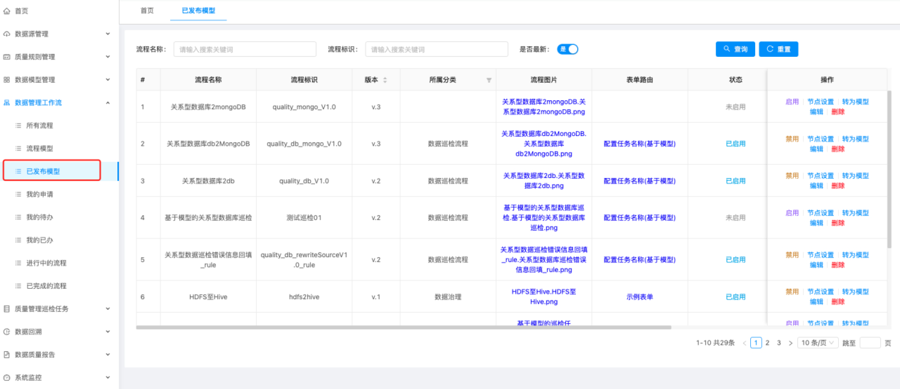

## Data Quality Management 数据质量管理

### Overview 概述

The data quality management system mainly inspects the database of the business system based on pre-set rules, generates inspection records through data inspection, and forms a data analysis report by analyzing the inspection records. The report reflects the status of the data. The status of the data includes: data accuracy, data integrity, data logical consistency, etc., which reflects the availability of the data and provides decision support for the next step of data governance and analysis.

数据质量管理系统主要基于预先设定的规则对业务系统的数据库进行巡检，通过数据巡检产生巡检记录，通过对巡检记录分析，形成数据分析报告，报告反映出了数据的情况。数据的情况包括：数据的准确性、数据的完整性、数据的逻辑一致性等，从而反映出了数据的可用性，为数据进行下一步的数据治理、分析提供了决策支持。

Use workflow technology to streamline complex business processes; iterative data models, use data rules and data models to accumulate knowledge; distributed, high-throughput, scalable software architecture; solve the challenges faced by traditional data flows
(1) System call failure, network failure, disk failure, software crash, human accident.
(2) Data access exceeds consumption capacity. Sometimes, a given data source may exceed the processing capacity of certain parts of the processing chain or delivery chain, and only one link needs to have a problem for the entire process to be affected.
(3) Beyond the boundary problem, you will always get data that is too large, too small, too fast, too slow, damaged, wrong, or in the wrong format.
(4) Real business or needs change faster, and designing new data processing processes or modifying existing processes must be fast.

采用工作流技术将复杂的业务流程化；可重复迭代的数据模型，采用数据规则、数据模型完成知识的积累；分布式、大吞吐，可伸缩的软件架构；解决解决传统数据流所面临的挑战
（1）系统调用失败，网络故障，磁盘故障，软件崩溃，人为事故。
（2）数据访问超出了消耗能力。有时，给定的数据源可能会超过处理链或交付链的某些部分的处理能力，而只需要一个环节出现问题，整个流程都会受到影响。
（3）超出边界问题，总是会得到太大、太小、太快、太慢、损坏、错误或格式错误的数据。
（4）现实业务或需求变更快，设计新的数据处理流程或者修改已有的流程必须要迅速。

### Functions 功能

Model Management 模型管理

Quality rule management 质量规则管理

Data Management Workflow Management 数据管理工作流管理

Demonstrates the application scenarios of data inspection currently supported by the system 展示了目前系统所支持的数据巡检的应用场景

Process Model 流程模型

Design process model 设计流程模型

Published Models 已发布的模型

Quality inspection 质量巡检

Data Flow 数据流

### Technology used 所用技术

- front-end 前端

  Vue2 、Antd

- back-end 后端

  Springboot+Mybatis、Redis、Flowable...

- Data 数据端

  Nifi、Hadoop、HDFS、Hive...