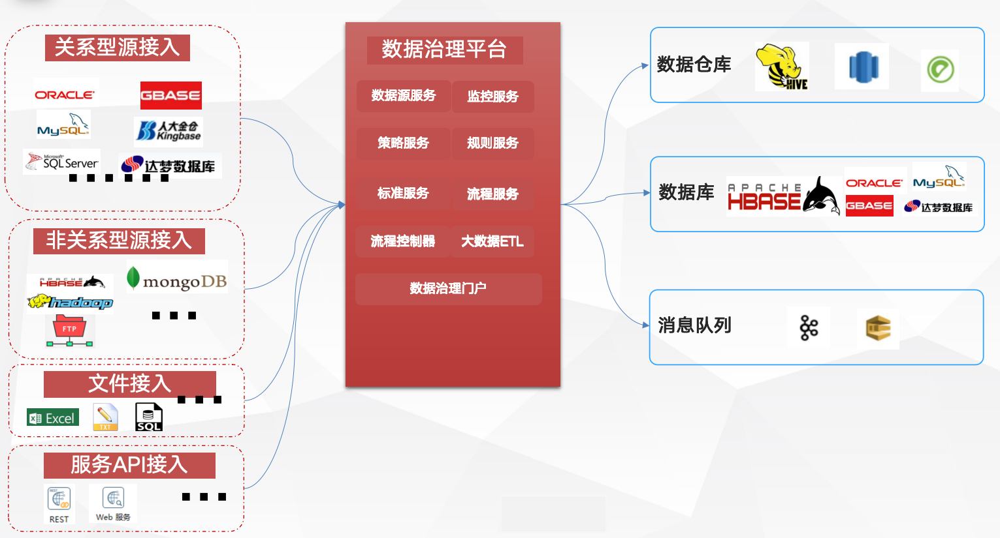
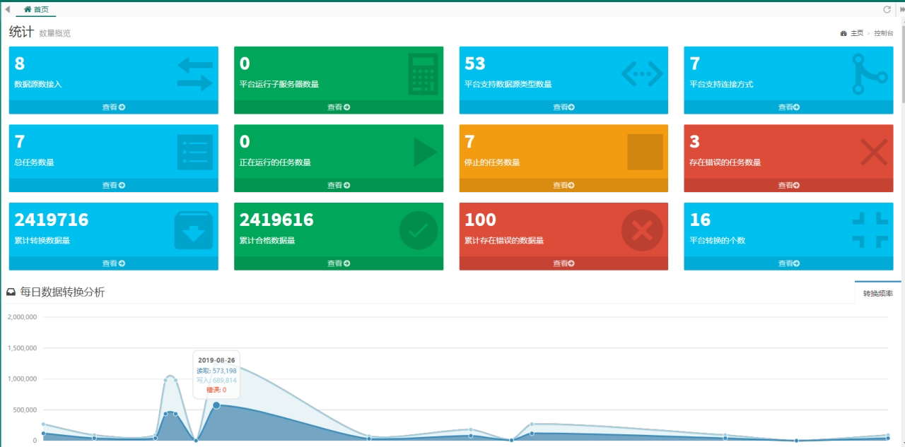
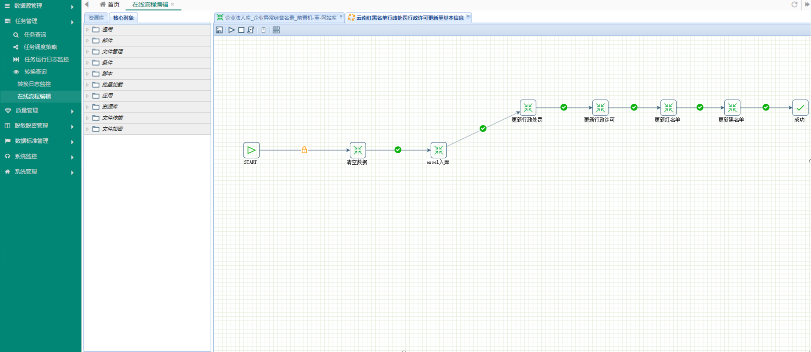

## Data governance platform 数据治理平台

### Overview 概述

The data governance system supports access to multiple data sources, supports the cleaning, conversion, and integration of heterogeneous data, and provides functions such as task management, rule management, quality management, automated processes, and visual monitoring. It ultimately realizes data processing, classification, and warehousing, providing support for the construction of thematic libraries and data service foundations.

数据治理系统支持多数据源接入，支持异构数据的清洗、转换、整合，提供任务管理、规则管理、质量管理、自动化流程和可视化监控等功能，最终实现数据的加工、分类和入库加载，为专题库建设和数据服务基础提供支撑。

### System Architecture 系统架构

Data source: Supports data source access of various mainstream relational databases, non-relational databases, files, and services.

数据源：支持各类主流的关系型数据库、非关系型数据库、文件、服务的数据源头接入。

The data distribution platform with visual process design plays the role of transporting, extracting, pushing, converting, aggregating and distributing big data. It can also be used in conjunction with the big data storage and various files, REST services, SOAP services, message services, etc. of the Hadoop ecosystem to form an integrated data flow service.

可视化流程设计的数据分发平台，起到大数据的搬运、提取、推送、转换、聚合、分发的作用，同时能够与Hadoop生态系统的大数据存储和各种文件、REST服务、SOAP服务、消息服务等联合使用，构成一体化的数据流服务。

### Functions 功能

### Technology used 所用技术

- front-end 前端

  jsp 、jquery

- back-end 后端

  Spring+SpringMVC+Mybatis、Redis、kettle core

- Data 数据端

  Hadoop、HDFS、Hive、mysql...