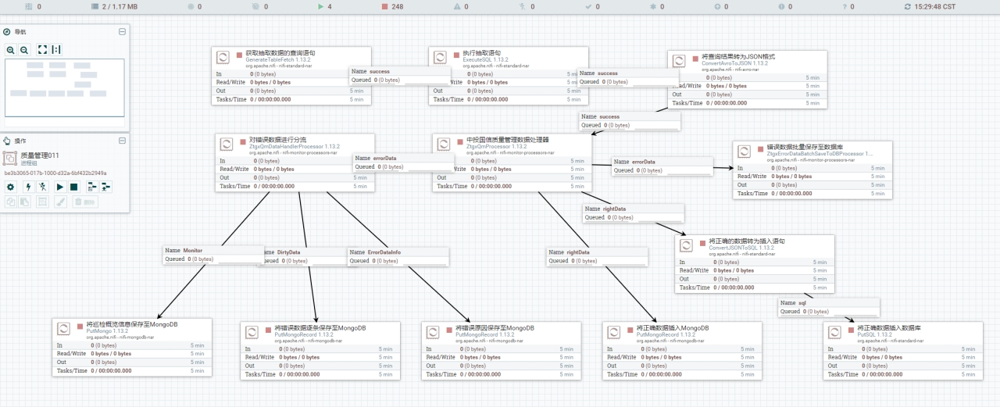

## Data Management System 数据管理系统

### Overview 概述

The data management system mainly completes data collection, data quality management, data query and statistics and visualization display, data resource original directory management, and data distribution.

数据管理系统主要完成数据的采集，数据的质量管理，数据的查询与统计和可视化展示，数据资源原目录管理，数据分发。

### Functions 功能

#### Home 主页

### Data reporting 数据报送

### Data quality 数据质量

### Statistics 数据统计

### 数据目录管理

### Data distribution 数据分发

1. The data management system distributes the collected and organized data to the ODS raw data layer of the credit warehouse;
2. The design of the DM public dimension layer and the DWD data detail layer is based on the dimensional modeling theory. The DM layer mainly stores data related to dimensions such as corporate legal persons, natural persons, and individual industrial and commercial households. The fact tables stored in the DWD layer mainly include fact tables such as administrative licenses, penalties, marriages, education, social security and provident funds.
3. The actual DWS layer relies on the indicator system. Take Jasmine Points as an example: hundreds of indicators of Jasmine Points are summarized through data governance.
4. The data is governed into the ADS data application layer required by our application through the distributed Spark computing engine.

1、数据管理系统将采集规整好的数据分发至信用数仓的ODS原始数据层；
2、DM公共维度层和DWD数据明细层的设计依托于维度建模理论， DM层主要存储企业法人、自然人、个体工商户等维度相关的数据，DWD层存储的事实表，主要包括行政政许可、处罚、婚姻、学历、社保公积金等事实表。
3、DWS层的实际依托于指标体系，以茉莉分为例：通过数据治理汇总出茉莉分的几百项指标。
4、通过分布式Spark计算引擎将数据治理成我们应用所需的ADS数据应用层。

### ETL 数据的清洗转换加载

### Data Flow 数据流

### Technology used 所用技术

- Front-end 前端

​       Vue

- Back-end 后端

  Springboot ,SpringCloud

- Data 数据端

  mysql,oracle,hadoop,hive,spark,Hbase...