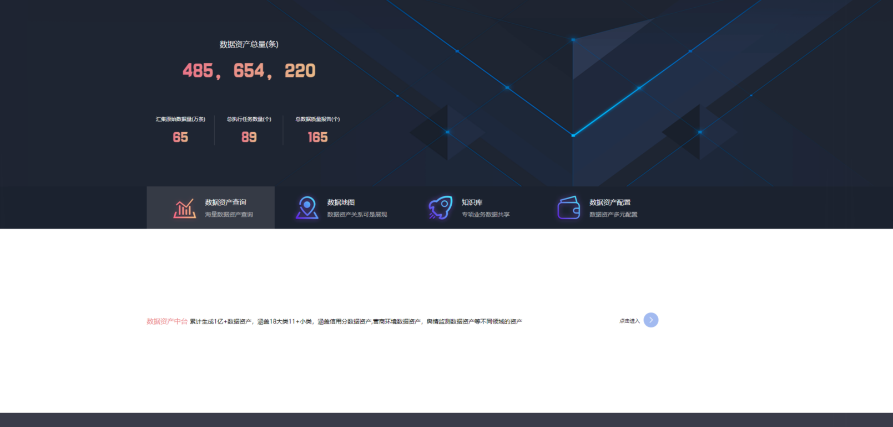
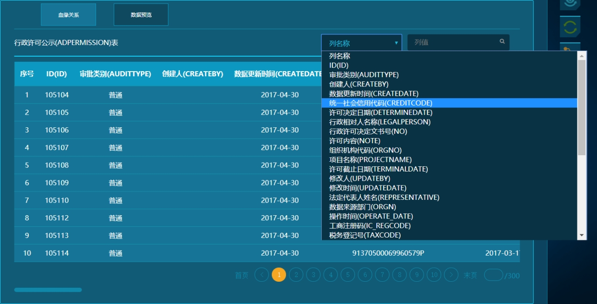
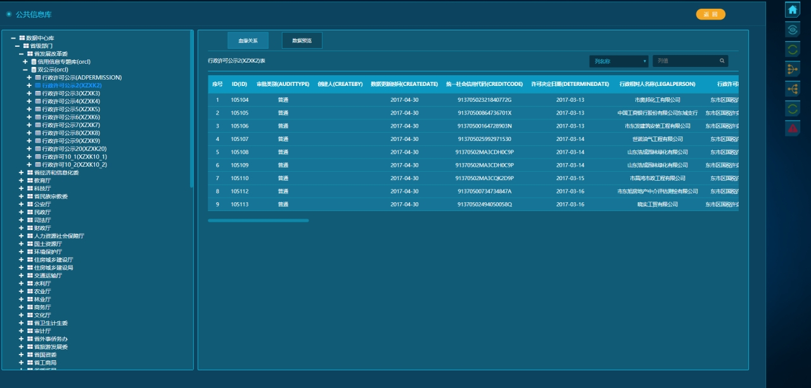
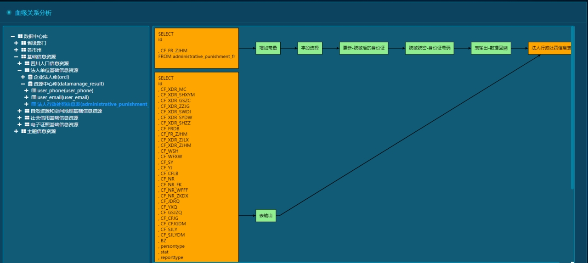
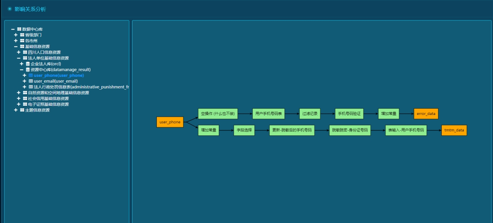
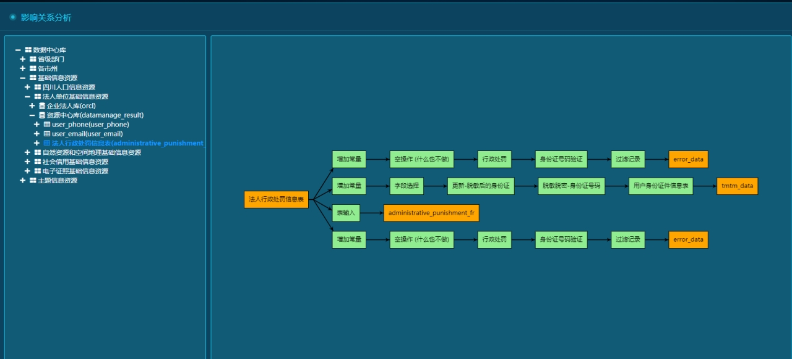
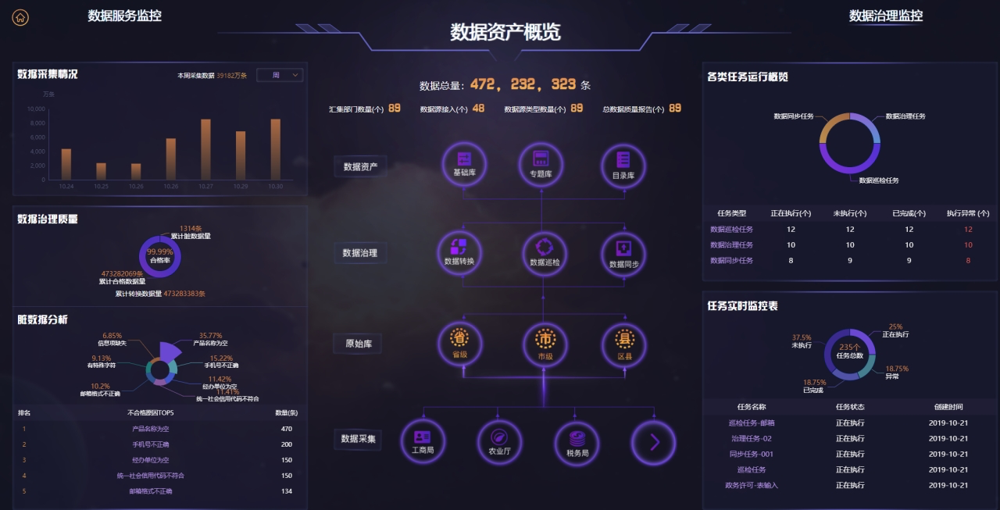
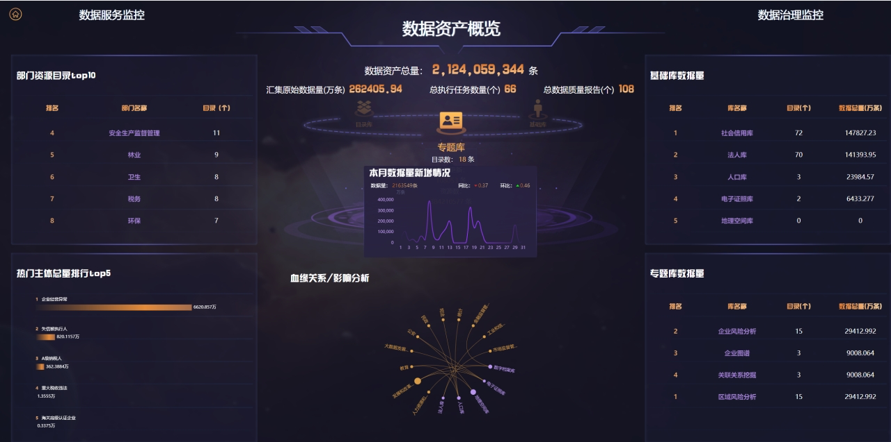

## Data assert 数据资产管理

### Overview 概述

The data asset management platform aims to achieve data asset management through data cataloging and labeling, form a data map, conduct unified query and management of overall data, aggregate all data information, and solve the difficult problems of "what data is available" and "where to find data" for data managers, thereby improving the utilization rate of data resources.

数据资产管理平台旨在通过数据目录化、标签化实现数据资产化管理，形成数据地图，对整体数据进行统一查询、管理，汇聚所有数据信息，为数据管理者解决"有哪些数据可用"、"到哪里可以找到数据"的难题，提升数据资源的利用率。

### Functions 功能

#### Data Query 数据查询

#### Lineage diagram 血缘图

The lineage diagram starts with the first generation ancestor of the target object and ends with the target analysis object, and expands layer by layer according to the transformation relationship. The lineage diagram intuitively shows the generation process of the target object, including which tables it was converted from and which transformations it has undergone, so as to help infer the meaning it has been given in the process and the potential impact it will be affected by.

血缘图以目标对象的第一代祖先为起点，以目标分析对象为终点，按照转化关系逐层扩展。血缘图直观的展示了目标对象的产生过程，包括从哪些表转换而来，经历了哪些转换，从而帮助推测出它在此过程中被赋予的含义，以及会受到的潜在影响。

#### starting point of the impact analysis 影响分析图

The starting point of the impact analysis diagram is the current analysis object, and the end point is the last child affected by it, which is expanded layer by layer according to the impact relationship. The impact analysis diagram reflects which metadata the current object participates in the formation of the unified data integration platform. Users can use the impact analysis diagram to observe the impact capability of the object, that is, which descendant metadata will be affected by the current metadata modification.

影响分析图的起点是当前分析对象，终点是受其影响的最末端子代，按照影响关系逐层扩展。影响分析图反映了当前对象在统一数据集成平台中，参与了哪些元数据的形成。用户可以借助影响分析图观察该对象的影响能力，即对于当前元数据修改，会对哪些后代元数据造成影响。

#### Data Asset Overview 数据资产概览

Analyze and monitor the platform's data volume, data collection, data governance, and operation tasks in real time.

对平台梳理数据量、数据采集情况、数据治理情况、运行任务的分析和实时监控

### Technology used 所用技术

- Front-end 前端

​       Vue

- Back-end 后端

  Springboot 、SpringCloud

- Data 数据端

  mysql、oracle、hadoop、hive、hbase...