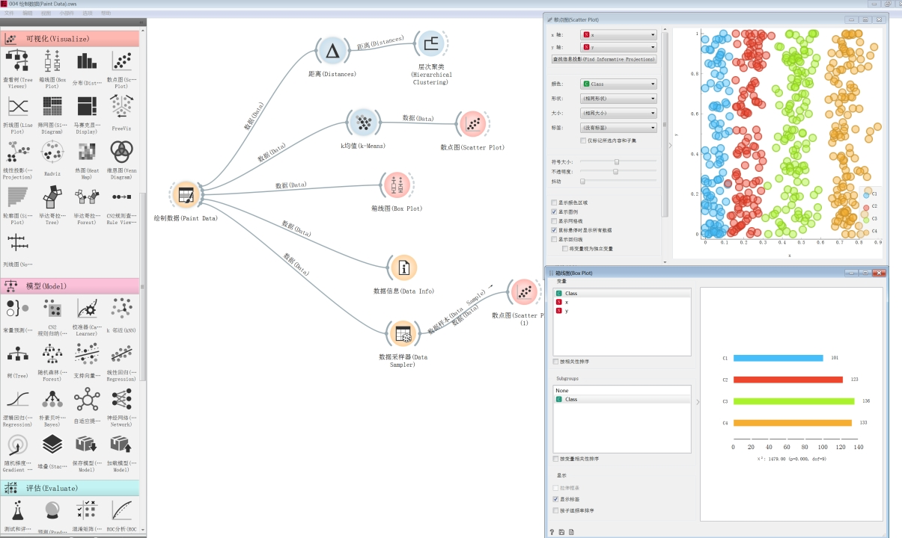

## Data mining and analysis platform 数据挖掘分析平台

### Overview 概述

The data mining and analysis platform integrates data preprocessing, feature engineering, statistical analysis, machine learning, neural networks, text analysis, etc. The platform combines credit business data to provide comprehensive data collection, processing, analysis, mining and other data capabilities, collects, extracts, processes, analyzes and displays data, and provides data support for the supervision and decision-making of popular indicators, key assessment indicators and key tasks.

1) Multi-source data access
Directly connect to the database or import local data, and can conveniently and effectively manage data by creating a new folder or saving it to a related folder. It is necessary to import mainstream structured, semi-structured and unstructured data types, including: relational databases (such as MySQL and Oracle), text files, CSV, time series, audio, pictures, etc., so as to effectively support the data needs of the analysis and mining process.
2) Data preprocessing
The data preprocessing function facilitates feature engineering, mainly including: data sampling, data segmentation, data conversion, data binning, data replacement, weight setting and selection, attribute generation, structured data feature extraction, text data feature extraction and other data preprocessing functions.
3) Business modeling
Each process of the business model is composed of multiple algorithms. Each algorithm accepts several inputs and produces several outputs. The output of each algorithm can be used as the input of other algorithms. Combined with the business logic, drag the algorithm related to the business system into the design panel, connect the input and output terminals as needed, and the process design can be completed. Through data reading, preprocessing or conversion, writing operations, model performance evaluation, model application and algorithm operators, with module instructions, drag and drop, free connection and layout methods, visual model training or model testing can be carried out. In the process of modeling, there will be many trial steps. It is necessary to compare different trial methods by adding algorithm branches in the process design, and then find the best prediction algorithm based on the prediction results.
4) Data and model preview
After the model logic is established, the modeling logic is saved in the platform persistent storage system in the form of a workflow. You can manually or automatically run your own or your partner's workflow at any time to observe the modeling effect. You can view the running status, running results and time of each algorithm at any time, and you can also view its running log to facilitate users to troubleshoot running failures. Through text, table, histogram, ROC curve chart, tree, forest and other views, it meets the preview requirements of different stages and different output types of data in the modeling process.
5) Data mining algorithm
The functions or algorithms required for the data mining process cover feature selection and extraction, classification, clustering, regression, association rule analysis, text mining and deep learning algorithm categories, and encapsulate data reading, preprocessing or conversion, writing operations, model performance evaluation, and model application operations as operators to keep the workflow construction process simple and consistent.
Machine learning algorithms should have classification algorithms, regression algorithms, clustering algorithms, association algorithms, etc.

数据挖掘分析平台集数据预处理、特征工程、统计分析、机器学习、神经网络、文本分析等为一体。平台结合信用业务数据，提供综合数据采集、处理、分析、挖掘等数据能力，进行数据的采集、提取、处理、分析、展现，为热门指标、重点考核指标、关键任务的监督决策提供数据支撑。
1)多源数据接入
直接连接数据库或导入本地数据，并可通过新建文件夹或保存到相关的文件夹的方式来对数据进行方便有效的管理。需要对主流的结构化、半结构化与非哦结构化数据类型进行导入，包括：关系型数据库（如MySQL和Oracle）、文本文件、CSV、时间序列、音频、图片等，从而有效支撑分析挖掘过程的数据需求。
2)数据预处理
数据预处理功能，方便特征工程进行，主要包括：数据取样、数据分割、数据转化、数据分箱、数据替换、权重设置与选取、属性生成、结构化数据特征提取、文本数据特征提取等数据预处理功能。
3)业务建模
业务模型每一个流程都是由多个算法组成，每个算法接受若干输入，产生若干输出。每个算法的输出都可以作为其他算法的输入。结合业务逻辑将与业务系统相关的算法拖拽到设计面板内，按需连接输入输出端，即可完成流程设计。通过数据的读入、预处理或转换、写出操作、模型性能评估、模型应用和算法算子，配以模块的使用说明、拖拽和自由的连线和布局方式，进行可视化的模型训练或模型测试。在建模的过程中，会有很多尝试性的步骤，需通过在流程设计中添加算法分支的方式来对比进行不同的尝试方法，然后根据预测结果找到最佳的预测算法。
4)数据和模型预览
在模型逻辑建立好以后，将建模逻辑以工作流的形式保存在平台持久化存储系统中，并可以随时手动或自动运行自己或协作伙伴的工作流以观察建模效果，可随时查看每个算法的运行状态、运行结果和时间，还可查看其运行日志，便于用户排查运行故障，通过文本、表格、直方图、ROC曲线图、树、森林等视图的方式，满足建模过程中的不同阶段、不同输出类型数据的预览需求。
5)数据挖掘算法
数据挖掘过程所需的函数或算法，涵盖特征选择和提取、分类、聚类、回归、关联规则分析、文本挖掘和深度学习算法类别，并将数据读入、预处理或转换、写出操作、模型性能评估、模型应用操作统一封装为算子，以保持工作流构建过程的简便和一致性。
机器学习算法应具备分类算法、回归算法、聚类算法、关联算法等。

### Function Display 功能展示

#### Data in 数据接入

#### Plotting the data 绘制数据

#### Credit score application 信用分应用

#### Text Mining 文本挖掘

#### Other 其他

