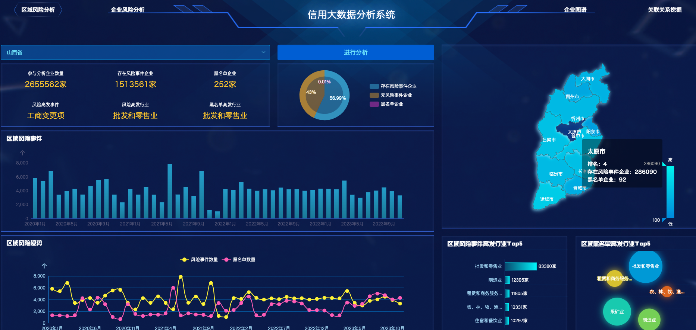

信用大数据分析平台通过关联图谱、关联关系挖掘可以对信用主体多维度信息关系进行深度挖掘，可直观的审视错综复杂的关联关系，对被分析的信用主体与存在风险事项的潜在关联性进行关联预警。基于关联图谱和关联关系挖掘可对信用主体风险事项进行数据钻取，同时提供区域和行业进行整体信用风险预警，刻画高发风险事项区域、行业关联预警画像等。提供地区、行业、地理位置、企业规模、企业性质等关键词智能查询，可精准筛选出批量目标企业。实现深度洞察企业多重关联、交叉关系，提供董监高关联、股东股权关系、司法关联等多维度搜索查询。平台主要包括企业图谱、关联关系图谱、企业风险分析和区域风险分析等功能模块。

The credit big data analysis platform can deeply mine the multi-dimensional information relationship of credit subjects through association maps and association relationship mining, and can intuitively examine the intricate association relationships and conduct association warnings on the potential association between the analyzed credit subject and risk items. Based on association maps and association relationship mining, data can be drilled on the risk items of credit subjects, and overall credit risk warnings can be provided for regions and industries, and portraits of high-risk areas and industry association warnings can be portrayed. It provides intelligent query of keywords such as region, industry, geographic location, enterprise scale, and enterprise nature, and can accurately screen out batches of target enterprises. It realizes in-depth insight into the multiple associations and cross-relationships of enterprises, and provides multi-dimensional search queries such as director, supervisor, and senior management associations, shareholder equity relations, and judicial associations. The platform mainly includes functional modules such as enterprise maps, association relationship maps, enterprise risk analysis, and regional risk analysis.

